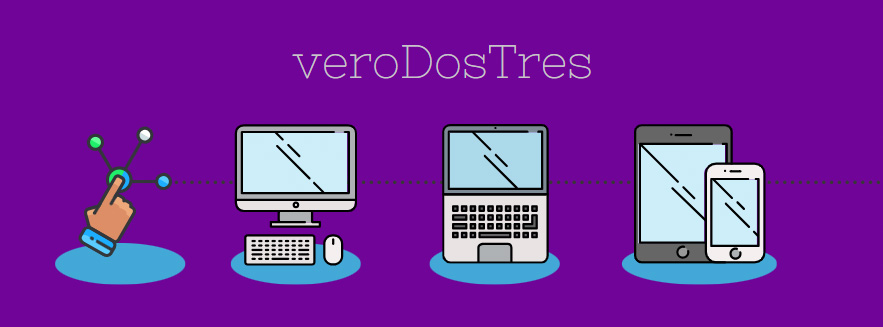

  

# 👋 ¡Hola! Soy **veroDosTres**  

¡Bienvenido a mi perfil de GitHub! 🎉 Soy una persona a la que le apasiona resolver problemas y estoy en camino de convertirme en una desarrolladora fullstack.

---

## 👩🏻‍🦰💻 Sobre mí

- 🎓 Graduada en **Desarrollo de Aplicaciones Multiplataforma (DAM)** con enfoque en backend.  
- 📖 Actualmente aprendiendo **frontend** para expandir mis habilidades.  
- 🧩 Me encanta enfrentar desafíos tecnológicos, porque para mí son como resolver un buen puzzle.  
- 🎯 Mi meta: Vivir de mi pasión por la programación.  

---

## 🛠️ Lenguajes y herramientas
Aquí están algunas de las tecnologías con las que he trabajado y estoy trabajando actualmente:

  
  
  
    
  
  
  
  
  

---

## 📚 Actualmente aprendiendo
- Desarollo de Aplicaciones Web  
- Ciberseguridad
---

## 🎮 Hobbies y algo curioso sobre mí

- 🍿 Me encanta jugar videojuegos y ver series (¡siempre con palomitas!).  
- 🛠️ Dato curioso: ¡Hackeé el juego **Los Sims** cuando tenía 11 años!  

---

## 🚀 Proyectos
Aunque estoy comenzando mi viaje, aquí están algunos de los proyecto que he subido a GitHub:  
1. ToDo App *https://github.com/veroDosTres/todo-app*
2. La próxima película de Marvel *https://github.com/veroDosTres/next-marvel-movie-class*

---

## 📫 Cómo contactarme
- 💌 Email: [verodostres23@gmail.com](mailto:verodostres23@gmail.com)  
-   

---

## 🌟 Gracias por visitar mi perfil

¡Espero que encuentres interesante lo que ves! Si tienes algún proyecto donde pueda colaborar, incluso en cosas sencillas pero desafiantes, ¡no dudes en escribirme! 😊

